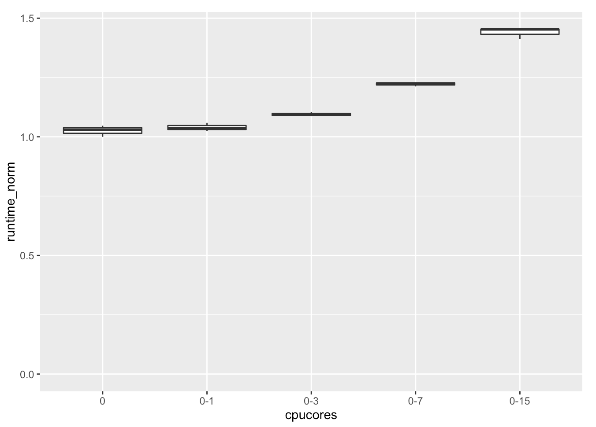

## Machine learning tools on monster EC2 X1 instance (128 cores, 2 TB RAM) 

Despite the deep learning hype, for most supervised learning problems on tabular data 
(the ones usually encountered in business) gradient boosting machines (GBMs) most often beat
all other algorithms. 

The two best of the most widely used open source implementations for GBMs 
are h2o and xgboost. 

In this repo I'll play with h2o and xgboost GBMs on Amazon EC2's X1 instance with 128 cores.

First, with h2o:

### Experiments on r3.8xlarge (32 cores)

r3.8xlarge has 2 CPU sockets with 8+8 hyperthreaded cores each

Cores 0-7 are on CPU1, 8-15 on CPU2, then 16-23 are hyperthread pairs of 0-7 etc.

From 0-3 (4 cores) adding another 4 cores hyperthreades (16-19) will speed up a bit,
but not even half-way as having 8 "real" cores. 

Having 8 real cores on 1 socket (0-7) is a bit better than on 2 sockets (0-4 & 8-11).

From 8 cores (0-7) to 16: if the added cores are hyperthreaded, there is only a 
little speedup (0-7 & 16-23). Adding real cores (0-15) helps.

There is almost no benefit from 16 cores to 32.

With no hyperthreaded cores, the relative speedup vs linear:

Weird that smaller r3 instances run faster:

Instance     | Time (s) 0-7  |  Time (s) 0-3 
-------------|---------------|----------------
r3.8xlarge   |   27          |    49
r3.4xlarge   |   24          |    44 
r3.2xlarge   |               |    44

r3.4xlarge should be 1 socket of the 2 sockets of r3.8xlarge.

### Experiments on x1.32xlarge (128 cores)

x1.32xlarge has 4 CPU sockets with 16+16 hyperthreaded cores each

Cores 0-15 are on CPU1, 16-31 on CPU2 etc., then 64-79 are hyperthread pairs of 0-15 etc.

