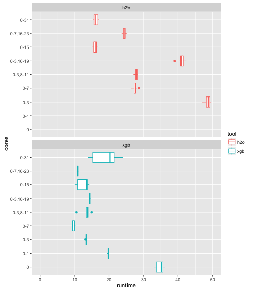
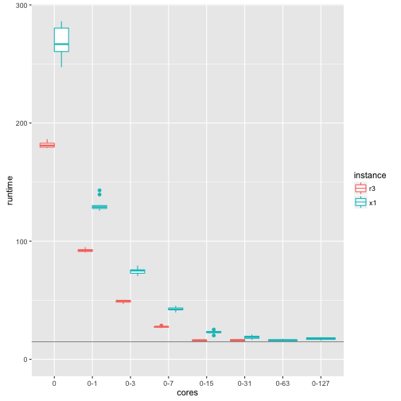

## Machine learning tools on monster EC2 X1 instance (128 cores, 2 TB RAM) 

Despite the deep learning hype, for most supervised learning problems on tabular data 
(the ones usually encountered in business) gradient boosting machines (GBMs) most often beat
all other algorithms. 

The two best of the most widely used open source implementations for GBMs 
are h2o and xgboost (see [benchmarks](https://github.com/szilard/benchm-ml)).

In this repo I'll take a look at the scalability of h2o and xgboost GBMs as a function
of the number of CPU cores on Amazon EC2's X1 (128 cores) and R3 (32 cores) instances.

This is not a competition between h2o and xgboost, both are excellent GBM implementations.
In this repo I'm mainly interested in how these best tools can take advantage of the 
growing number of CPU cores available in modern hardware.

### r3.8xlarge (32 cores)

r3.8xlarge has 2 CPU sockets with 8+8 hyperthreaded cores each.
Cores 0-7 are on CPU1, 8-15 on CPU2, then 16-23 are hyperthread pairs of 0-7 etc.

h2o speeds-up with increased number of cores up to 16 (except when hyperthreaded). 

xgboost speeds-up up to 8 cores only, and only if on the same CPU (but it ends up 
anyway a bit faster than h2o max speed).

### x1.32xlarge (128 cores)

x1.32xlarge has 4 CPU sockets with 16+16 hyperthreaded cores each.
Cores 0-15 are on CPU1, 16-31 on CPU2 etc., then 64-79 are hyperthread pairs of 0-15 etc.

h2o speeds-up at diminishing rates of return over 16 cores (and best if all cores on same CPU and
not hyperthreaded).

xgboost speeds-up up to 16 cores (if on same CPU and not hyprethreaded).

### h2o

h2o is faster on r3 than on x1 if restricted to same number of cores and it gets about
at the same speed on r3 and x1 if all cores used (32/128 respectively).

### xgboost 

xgboost is just a bit slower on x1 than r3 on same number of cores, and it gets slower if number 
of cores is more than 8 on r3 or 16 on x1 (and it's just a bit faster on x1-16 then r3-8 cores).

## Summary

As of Nov 2016 [versions](versions.txt), both h2o and xgboost struggle on machines with
a high numbers of CPUs/cores. h2o shows diminishing returns on cores on different CPU
sockets or hyperthreaded cores. xgboost even slows down in such situations. Possible
causes are under investigation, but it surely has to do with the intricacies of CPU/memory 
architecture/hierarchy.

