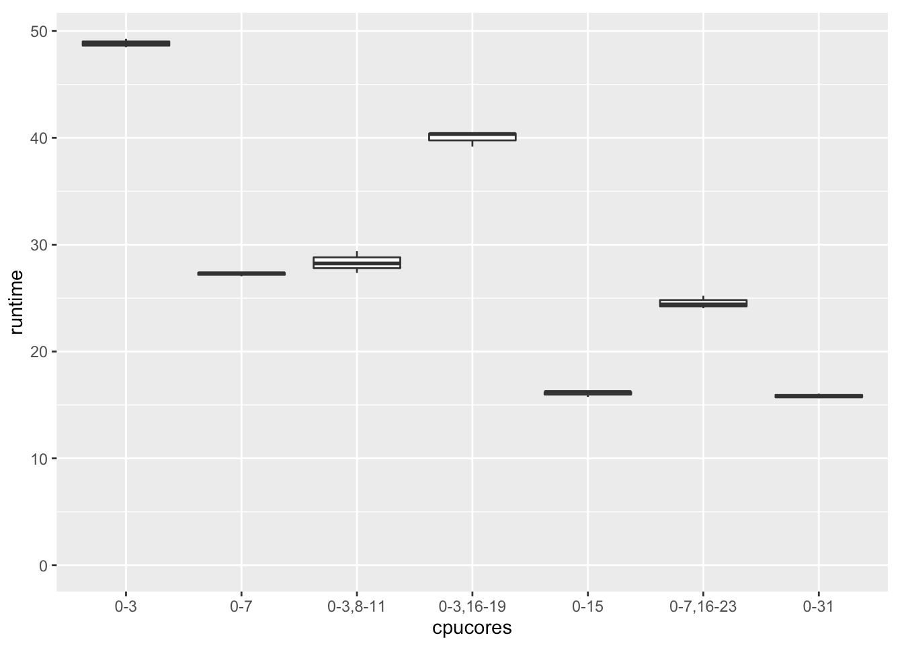

## Machine learning tools on monster EC2 X1 instance (128 cores, 2 TB RAM) 

### Experiments on r3.8xlarge (32 cores)

r3.8xlarge has 2 CPU sockets with 8+8 hyperthreaded cores each

Cores 0-7 are on CPU1, 8-15 on CPU2, then 16-23 are hyperthread pairs of 0-7 etc.

From 0-3 (4 cores) adding another 4 cores hyperthreades (16-19) will speed up a bit,
but not even half-way as having 8 "real" cores. 

Having 8 real cores on 1 socket (0-7) is a bit better than on 2 sockets (0-4 & 8-11).

From 8 cores (0-7) to 16: if the added cores are hyperthreaded, there is only a 
little speedup (0-7 & 16-23). Adding real cores (0-15) helps.

There is almost no benefit from 16 cores to 32.

With no hyperthreaded cores, the relative speedup vs linear:

