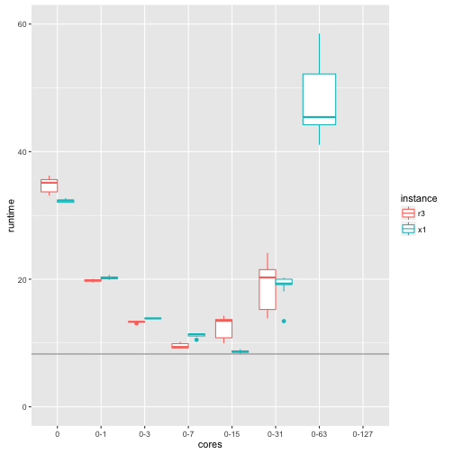

## Machine learning tools on monster EC2 X1 instance (128 cores, 2 TB RAM) 

Despite the deep learning hype, for most supervised learning problems on tabular data 
(the ones usually encountered in business) gradient boosting machines (GBMs) most often beat
all other algorithms. 

The two best of the most widely used open source implementations for GBMs 
are h2o and xgboost (see [benchmarks](https://github.com/szilard/benchm-ml)).

In this repo I'll take a look at the scalability of h2o and xgboost GBMs as a function
of the number of CPU cores on Amazon EC2's X1 (128 cores) and R3 (32 cores) instances.

This is not a competition between h2o and xgboost, both are excellent GBM implementations.
In this repo I'm mainly interested in how these best tools can take advantage of the 
growing number of CPU cores available in hardware.

### r3.8xlarge (32 cores)

r3.8xlarge has 2 CPU sockets with 8+8 hyperthreaded cores each.
Cores 0-7 are on CPU1, 8-15 on CPU2, then 16-23 are hyperthread pairs of 0-7 etc.

### x1.32xlarge (128 cores)

x1.32xlarge has 4 CPU sockets with 16+16 hyperthreaded cores each.
Cores 0-15 are on CPU1, 16-31 on CPU2 etc., then 64-79 are hyperthread pairs of 0-15 etc.

### h2o

### xgboost 

